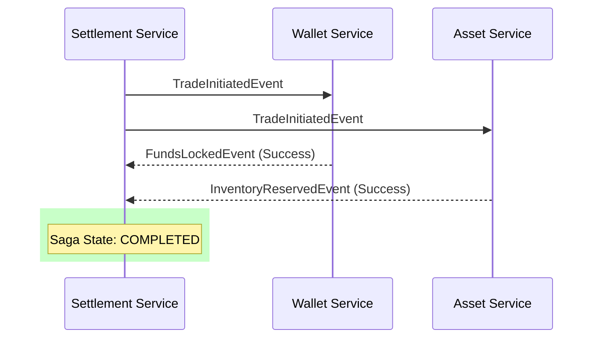
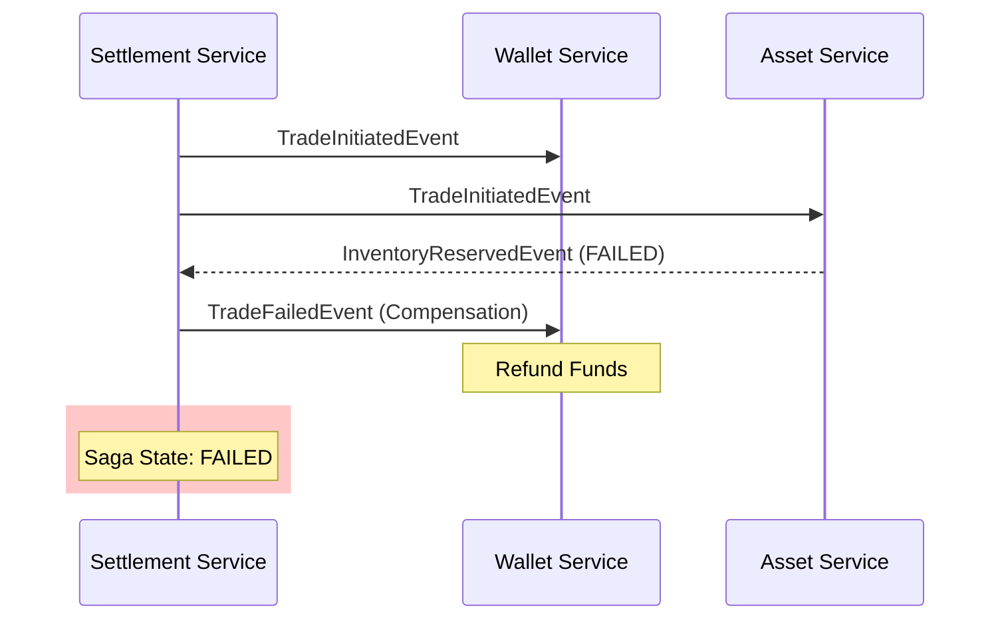

# Distributed RWA Tokenization & Settlement Engine

A production-ready, microservices-based system for fractionalizing and settling Real-World Assets (Gold, Silver, Real Estate) on-chain utilizing Hyperledger Besu.

## Architecture
- **asset-service (The Tokenizer)**: Manages "Digital Twins" and fractional reserves. Handles yield generation and NAV updates.
- **identity-wallet-service (The Vault)**: Manages user balances, KYC status, and AML compliance limits.
- **order-service (The Exchange)**: secondary market matching engine for BID/ASK orders.
- **pricing-service (The Oracle)**: Simulates real-time price feeds for assets (e.g., Gold spot price).
- **settlement-service (The Orchestrator)**: Coordinates the Saga for primary issuance and bridges secondary trades to the blockchain.

## Infrastructure Setup
A `docker-compose.yml` is provided at the root level which will spin up:
- **5 PostgreSQL instances**: Dedicated storage for each microservice.
- **Kafka & Zookeeper**: Event-driven backbone for choreography-based Sagas.
- **Hyperledger Besu**: Ethereum-compatible private blockchain node for final settlement.
- **Redis**: Caching layer for fast asset lookups.
- **Prometheus & Grafana**: Real-time observability and performance metrics.

## Key Features

### 1. Identity & Compliance (KYC/AML)
- **KYC Enforcement**: Transactions are blocked unless the user has a `VERIFIED` status.
- **AML Limits**: Real-time enforcement of daily and monthly transaction volume limits.

### 2. Secondary Market Matching
- **Price-Priority Engine**: The `order-service` matches buy and sell orders based on competitive pricing.
- **Blockchain Settlement**: Matched trades trigger an atomic `engineTransfer` on the `RWAToken.sol` smart contract in `settlement-service`.

### 3. Yield Distribution
- **Automated Yields**: `asset-service` periodically calculates and broadcasts yield distributions.
- **Wallet Crediting**: Holders automatically receive yield credits in their digital wallets.

## Distributed Saga (Choreographed Orchestration)

The platform relies on an Event-Driven Architecture using the **Outbox Pattern** to ensure reliable, at-least-once message delivery.

### Happy Path (Primary Issuance)
1. **Settlement Service**: Initiates `TradeSaga` in `PENDING` state and emits `TradeInitiatedEvent`.
2. **Wallet Service**: Receives event, checks KYC, locks funds (Debit), and emits `FundsLockedEvent`.
3. **Asset Service**: Receives event, checks inventory, reserves fractions (Optimistic Locking), and emits `InventoryReservedEvent`.
4. **Settlement Service**: Collects both successful events, updates status to `COMPLETED`, and finalizes the record.



### Failure Path (Compensating Transactions)
Financial integrity is maintained via compensating transactions triggered by `TradeFailedEvent`.

- **Insufficient Inventory**: `Asset Service` emits failure -> `Settlement Service` emits `TradeFailedEvent` -> `Wallet Service` **Refunds** locked funds.
- **Insufficient Funds**: `Wallet Service` emits failure -> `Settlement Service` emits `TradeFailedEvent` -> `Asset Service` **Releases** reserved fractions.
- **KYC Violation**: `Wallet Service` blocks lock -> `Settlement Service` rolls back entire Saga.



## Running the Application

### 1. Infrastructure (Docker)
Ensure Docker is running and spin up the environment:
```bash
docker-compose up -d
```

### 2. Build & Install
Crucial to build `common-lib` first to propagate updated DTOs:
```bash
mvn clean install -DskipTests
```

### 3. Verification Scripts
We provide two scripts to verify system behavior:
- **`./test-rwa.sh`**: Verifies the "Happy Path" (Success case).
- **`./test-negative-rwa.sh`**: Verifies "Failure Paths" (Inventory/Funds/KYC failures).

### 4. Monitoring
- **Prometheus**: `http://localhost:9090`
- **Grafana**: `http://localhost:3000` (Default: admin/admin)
- **Kafka UI**: `http://localhost:8080`

